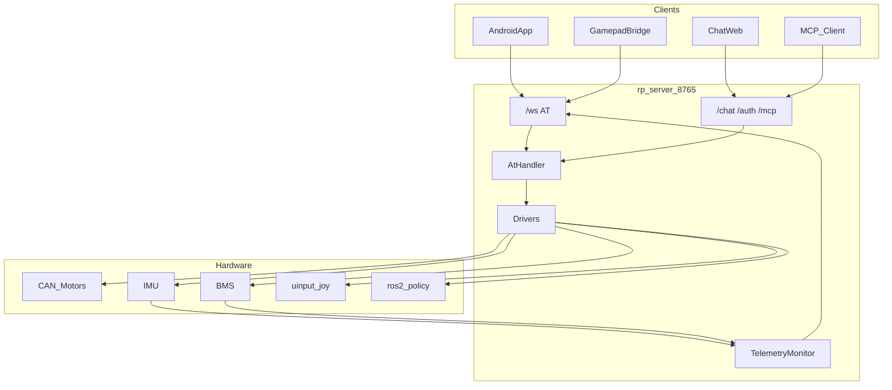

# rp_server 架构与数据流

## 三层架构

```text
transport/   WebSocket / 串口 / 蓝牙          ← 可换传输
protocol/    AT 解析 + AtHandler 分发         ← 核心抽象
drivers/     motors / imu / bms / joy / policy ← 硬件
```

同进程 REST 扩展（不另起端口）：

| 模块 | 路径 | 作用 |
|------|------|------|
| auth | `/auth/*` | 二维码登录 → JWT |
| chat | `/chat` | DeepSeek 连续对话 |
| mcp | `/mcp/*` | 把 AT 能力封成工具 |

## 数据流



## 手柄链路

```text
大疆/G12/evdev → gamepad bridge → AT+BTN/JOY → WS → JoyDriver(uinput) → 推理/电机
```

模拟验证：`python3 scripts/gamepad_bridge.py --mode sim`

## MCP 工具

只读默认开：`robot_conn` / `robot_sysinfo` / `robot_errors` / `robot_policy_status` / `robot_status`  
写操作需 `mcp.readonly: false`：`robot_policy_control` / `robot_button`
