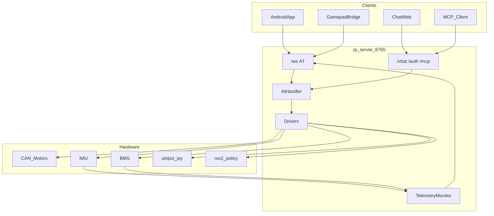

# rp_server Architecture & Data Flow

## Three-Layer Architecture

```text
transport/   WebSocket / Serial / Bluetooth          ← swappable transports
protocol/    AT parsing + AtHandler dispatch         ← core abstraction
drivers/     motors / imu / bms / joy / policy       ← hardware
```

In-process REST extensions (same port):

| Module | Path | Purpose |
|--------|------|---------|
| auth | `/auth/*` | QR login → JWT |
| chat | `/chat` | DeepSeek multi-turn chat |
| mcp | `/mcp/*` | AT capabilities as MCP tools |

## Data Flow



## Gamepad Pipeline

```text
DJI/G12/evdev → gamepad bridge → AT+BTN/JOY → WS → JoyDriver(uinput) → inference/motors
```

Simulation test: `python3 scripts/gamepad_bridge.py --mode sim`

## MCP Tools

Read-only (default on): `robot_conn` / `robot_sysinfo` / `robot_errors` / `robot_policy_status` / `robot_status`
Write ops require `mcp.readonly: false`: `robot_policy_control` / `robot_button`
